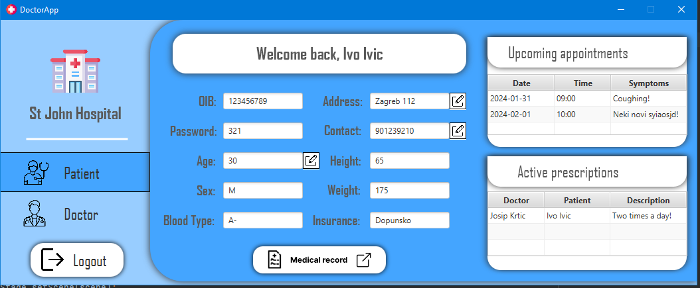
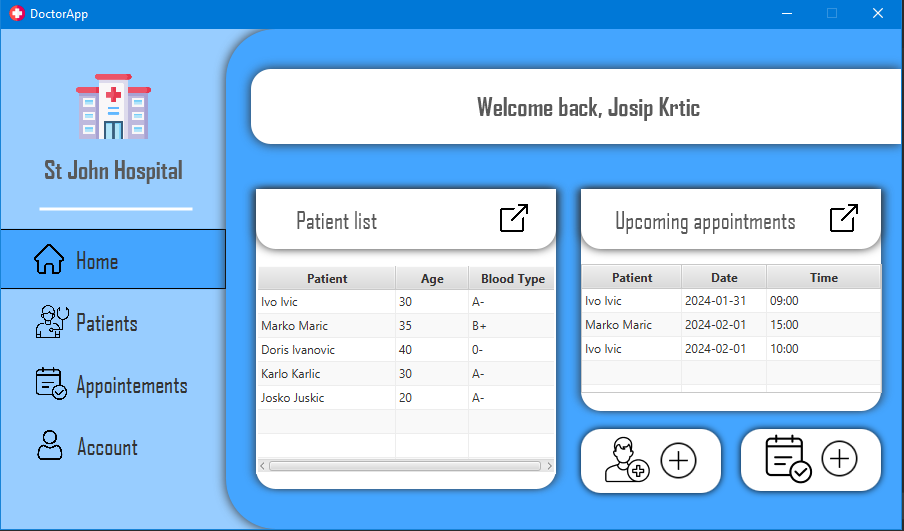
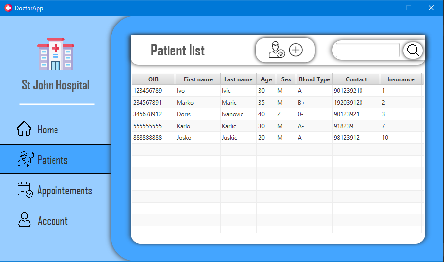
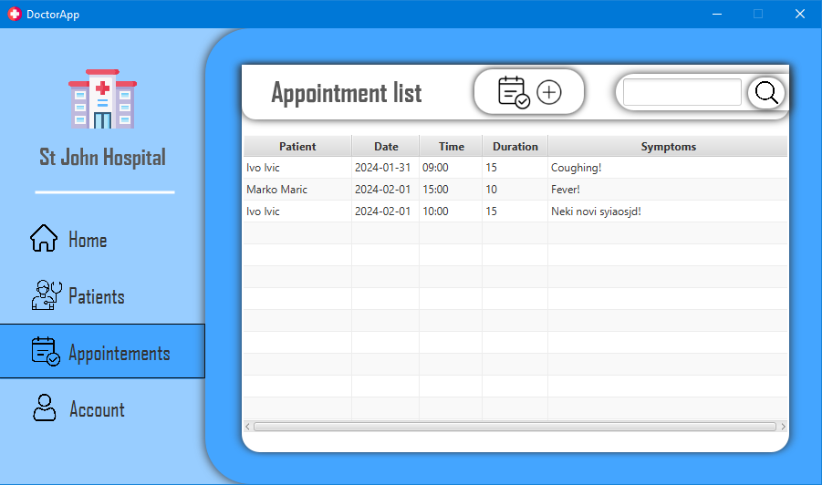
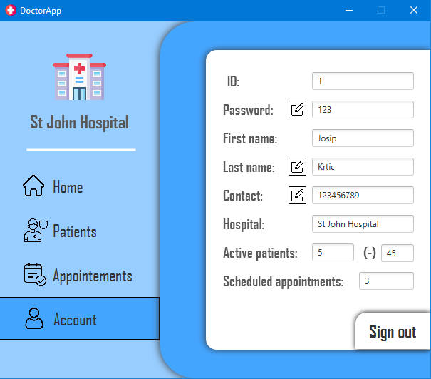
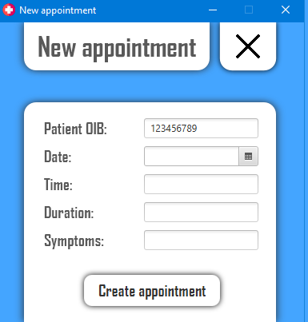
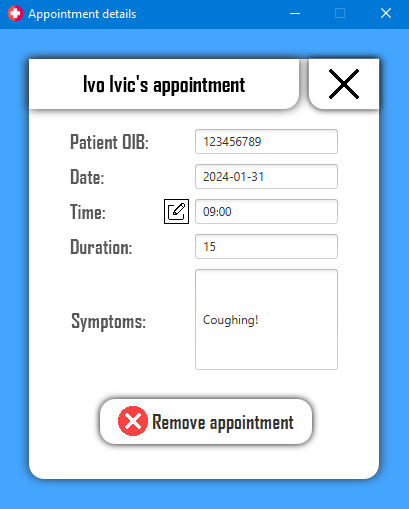
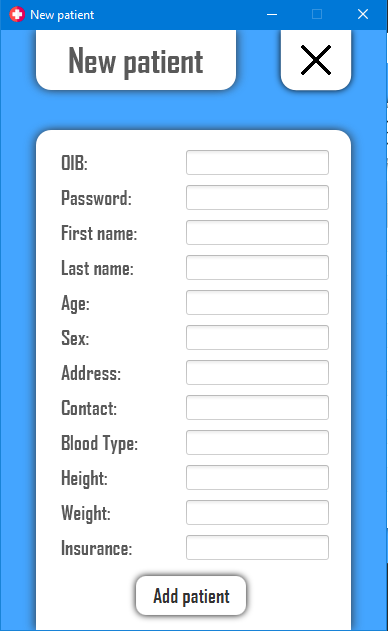
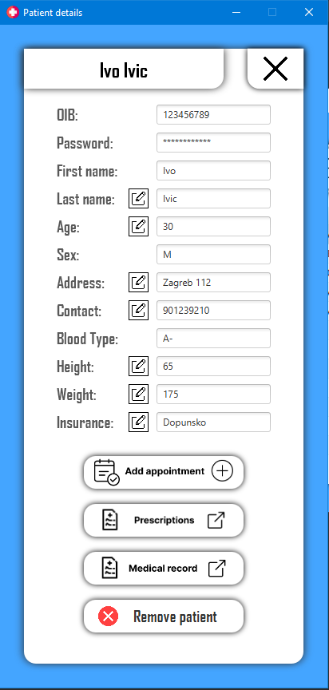
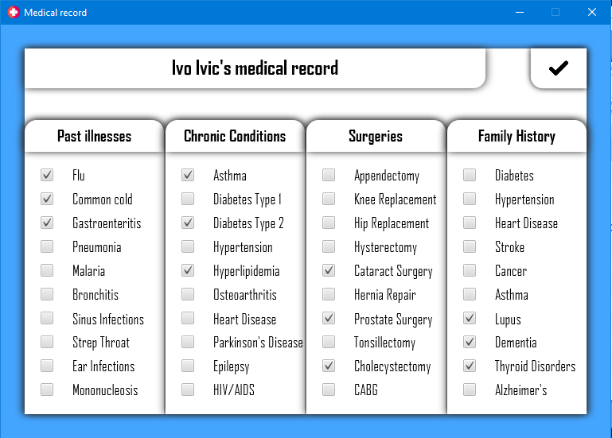

<h1 align="center">DoctorApp JavaFX Application with Microsoft SQL Server connection</h1>
<ul align"left">The following was implemented inside the application and database:
    <li>8 entities</li>
    <li>CRUD operations</li>
    <li>Indexes and constraints</li>
    <li>Stored procedures and functions</li>
    <li>Triggers</li>
    <li>Cryptography</li>
    <li>Dynamic data masking</li>
    <li>Database restore</li>
</ul>

    
Login Page

       
    
Patient Home Page

       
    
Doctor Home Page

       
    
Patient List Page

       
    
Appointment List Page

       
    
Account Page

       
    
Create Appointment Page

       
    
Appointment Details Page

       
    
Add Patients Page

       
    
Patient Details Page

       
    
Create Prescription Page

       
    
Medical Record Page

       

